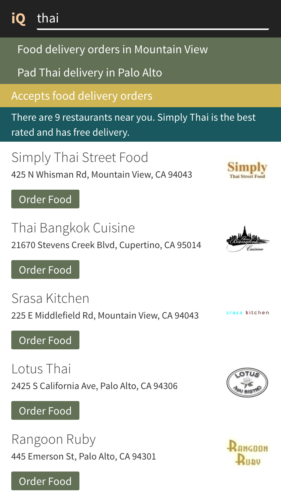
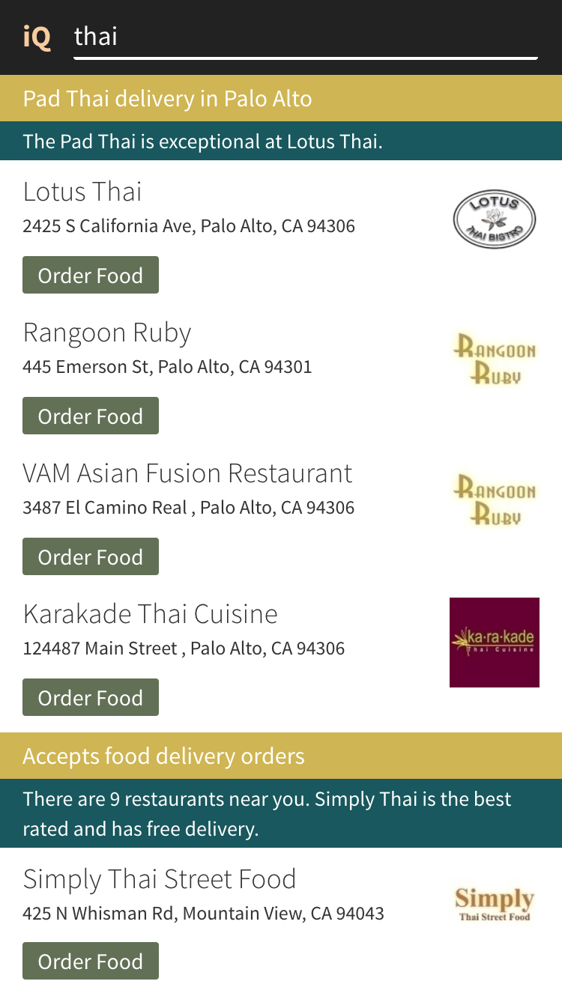

# Quixey IQ

Hackathon project to build a mobile web search client for the Quixey (http://quixey.com) Deep Search API.

IQ features a system of progressive refinements to expand and explore related search queries. The refinements are natural language facets, which allow the user to discover related sets of results with the intent is vague or the intent is to browse.

The back-end system is mocked by a node service, which also relays API requests to 3rd party systems.

The Quixey API is not a public API, so credentials have been removed. The API response for the thai example has been cached statically.

## Example:

- Query: *"thai"*


- *thai* restaurants that *accept delivery orders*



- *thai* restaurants that *accept delivery orders* in *palo alto*




## Not able to complete (in Hackathon timelimit)

- Grunt unit tests
- History API for better state management
- Upgrade react to use some pretty css animations

## Frameworks

Backend: node.js

Frontend: react, bootstrap


# Installation


## OS X Setup

```
brew install node
sudo npm install -g bower grunt browserify uglify-js grunt-cli babelify
npm install
```


### Build

```
grunt
```

### Test

```
grunt test
```


### Watch templates

```
grunt watch
```


# Run

```
node server.js
```


Made with love, @phillipnelson
